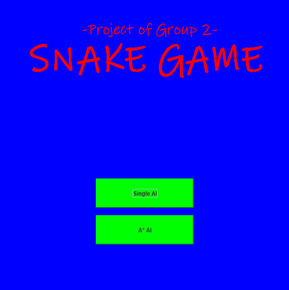
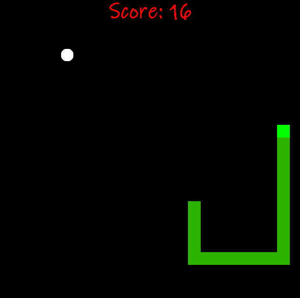
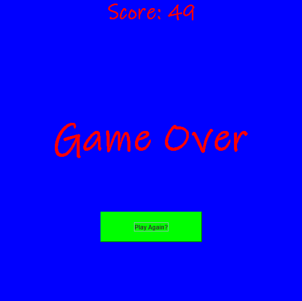

# AI-Snake_Project
## Members of Team:
  + Hoàng Hữu Hiếu (C) 
  + Hoàng Mạnh Hùng
  + Trần Bỉnh Hướng
  + Nguyễn Triệu Vương
  + Nguyễn Bá Kiên Lợn
## Ý tưởng: 
Dùng thuật toán tìm kiếm A* tạo game rắn tự động. Con rắn được bao quanh bởi 4 bức tường, mồi mới xuất hiện ngẫu nhiên 1 vị trí sau khi rắn ăn mồi cũ. Trò chơi kết thúc khi rắn đâm vào bức tường hoặc đâm vào thân/đuôi chính nó.

## Phương án triển khai công việc:
  + áp dụng thuật toán vào như thế nào 

## Background:

## Kết Luận: 
 + thành quả
 + ưu nhược điểm 
