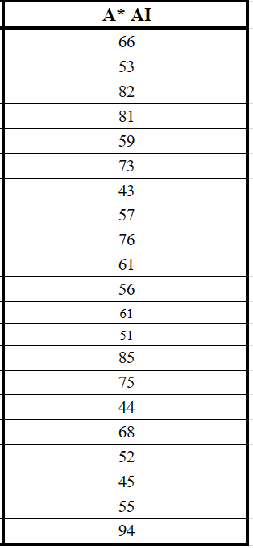

# AI-Snake_Project
## Members of Team:
  + Hoàng Hữu Hiếu (C) 
  + Hoàng Mạnh Hùng
  + Trần Bỉnh Hướng
  + Nguyễn Triệu Vương
  + Nguyễn Bá Kiên
## Cách sử dụng:
Clone repo về, sau đó vào src/App.java và chạy. Khi bắt đầu chạy, cửa sổ giao diện chính hiện lên, người chơi chỉ cần nhấn vào nút "Play AI" màu xanh lục, chuyển sang cửa sổ mà ở đó rắn tự chuyển động đến mồi, người chơi chỉ cần xem rắn đi tự động ăn được bao điểm, cho đến khi rắn cắn thân nó, nghĩa là trò chơi kết thúc, một cửa sổ Game Over hiện ra, cho phép người chơi nhấn "Play Again?" để chơi lại.

**_Lưu ý_**: các class trong mục src đã được comment giải thích ở đầu dòng, trong đó 2 class quan trọng nhất là 'SingleAIPanel' và 'AStarAIPanel' đã được chèn docstring java comment giải thích kỹ lưỡng mỗi function.
## Giới thiệu:
Trò chơi con rắn là một trò chơi phổ biến cách đây khoảng mười năm cũng là một trò chơi yêu thích của chúng tôi vì thế chúng tôi đã kết hợp trò chơi yêu thích và ngành học để tái hiện lại trò chơi con rắn.

## Ý tưởng: 
- Phát triển từ sản phẩm game rắn săn mồi đã được làm trong môn Lập trình hướng đối tượng.
- Dùng thuật toán tìm kiếm A* tạo game rắn tự động. Con rắn được bao quanh bởi 4 bức tường, mồi mới xuất hiện ngẫu nhiên 1 vị trí sau khi rắn ăn mồi cũ. Trò chơi kết thúc khi rắn đâm vào bức tường hoặc đâm vào thân/đuôi chính mình. Mục tiêu của chúng tôi là trò chơi con rắn chơi được ở chế độ máy chơi. Chúng tôi áp dụng tìm kiếm A* trong bài để tìm kiếm.

## Tìm kiếm A* là gì? (A* algorithm)
A* là thuật toán tìm kiếm trong đồ thị, thuật toán sẽ tìm một đường tối ưu nhất từ vị trí ban đầu đến vị trí đích. Thuật toán sử dụng "đánh giá heurstic" để sắp xếp từng loại từng điểm đến để đến vị trị tốt nhất. Thuật toán sẽ duyệt qua các vị trí đích đích theo đánh giá của heuristic này.

## Phương án triển khai công việc:
  + Trước tiên dựng game bằng ngôn ngữ java, 
  + Tiếp theo sẽ tạo con rắn và tạo mỗi ngẫu nhiên. 
  + (2 phần trên đã được học và hướng dẫn làm trong môn học 'lập trình hướng đối tượng')
  + Cuối cùng kết hợp thuật toán A* để cho con rắn tự động di chuyển.
  

## Background:
  + Giao diện bắt đầu
  

  + Giao diện vào game
  

  + Giao diện trò chơi kết thúc
  

## Kết Luận: 
Nhận xét: 
Đây là bảng đánh giá kết quả sau 20 lần chạy thử:

  
Ưu điểm: 
  
 - Chế độ chơi thú vị và chân thật: Tạo trò chơi rắn ăn mồi tự động sử dụng thuật toán A* giúp tạo ra một trò chơi thú vị, có tính thử thách và giống như chơi với người thật.
  
- Tăng khả năng tư duy của người chơi: Trò chơi này đòi hỏi người chơi có khả năng suy nghĩ logic, tính toán, đặc biệt là phát triển khả năng giải quyết vấn đề.
          
 - Tăng cường tính tương tác: Trò chơi cho phép người chơi tương tác với môi trường, tạo ra lối chơi tự do, góp phần giúp người chơi thoải mái thư giãn và giải trí.
            
 - Thêm thành công chế độ rắn đi qua bức tường và xuất hiện ở tường bên kia, góp phần giảm đi xác suất game over mỗi khi bị kẹp giữa thân rắn và biên của hộp.
            
Nhược điểm: 

- Tính tương đối khó điều chỉnh: Thuật toán A* thuộc loại đường đi ngắn nhất và không dễ dàng thay đổi được thuật toán và sửa đổi, điều này làm cho trò chơi rắn săn mồi tự động dùng thuật toán A* cũng khó được thay đổi. 

- Độ khó tăng nhanh: Trò chơi rắn săn mồi tự động dùng thuật toán A* có độ khó tăng lên rất nhanh, đặc biệt là ở những cấp độ sau (khi thân rắn dài ra), do đó tổng thời gian chơi của người chơi cũng sẽ ngắn hơn.
 
- Do tìm đường tốt nhất đến mồi nó xác suất cao khiến con rắn đi vào đường cùng và cắn vào đuôi/ thân chính mình.

## Tài liệu tham khảo:
  + Project đã làm trong môn 'Lập trình hướng đối tượng': https://github.com/NguyenTrieuVuong/SnakeGame
  + https://github.com/Yellowatch/Java-Snake-Game
  + https://github.com/GreenSlime96/PathFinding
